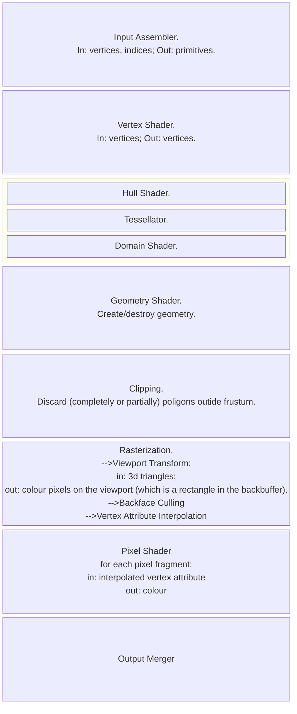

# d3d12-experiments
Graphics pipeline in D3D12

```mermaid
block-beta
columns 1
IA["Input Assembler.
In: vertices, indices; Out: primitives."]:1

VS["Vertex Shader.
In: vertices; Out: vertices."]:1

block
	columns 1
	HS["Hull Shader."]:1
	Tess["Tessellator."]:1
	DS["Domain Shader."]:1
end

GS["Geometry Shader.
Create/destroy geometry."]:1

Clip["Clipping.
Discard (completely or partially) poligons outide frustum."]:1

Rasterize["Rasterization.
-->Viewport Transform: 
  in: 3d triangles; 
  out: colour pixels on the viewport (which is a rectangle in the backbuffer).
-->Backface Culling
-->Vertex Attribute Interpolation
"]

PS["Pixel Shader
for each pixel fragment: 
    in: interpolated vertex attribute
	out: colour"]

OM["Output Merger"]

```
