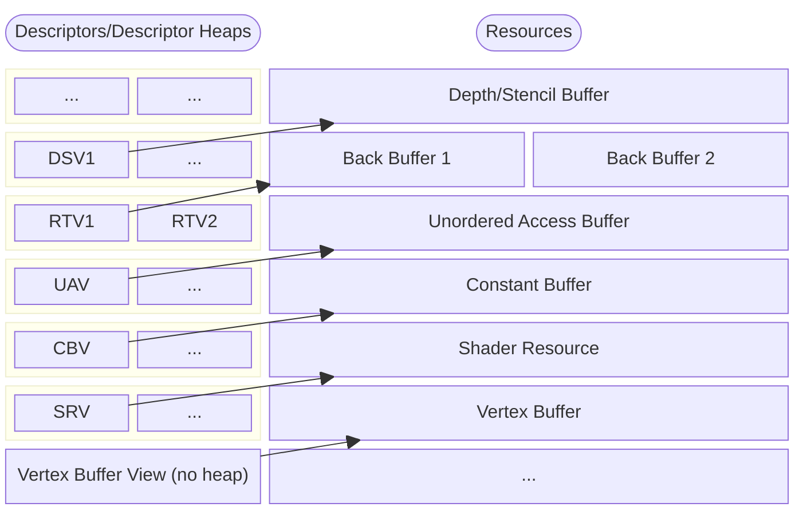

# d3d12-experiments
Resource Management in D3D12

```mermaid
block-beta
columns 3
desc_label(["Descriptors/Descriptor Heaps"]):1
res_label(["Resources"]):2

block
	columns 2
	dummy_descriptor_for_shift_1["..."] dummy_descriptor_for_shift_2["..."] 
end

ds_1["Depth/Stencil Buffer"]:2
block
	columns 2
	dsv_1["DSV1"] dsv_n["..."]
end

rt_1["Back Buffer 1"]:1
rt21["Back Buffer 2"]:1
block
    columns 2
	rtv_1["RTV1"] rtv_n["RTV2"]
end

ua_1["Unordered Access Buffer"]:2
block
    columns 2
	uav_1["UAV"] uav_n["..."]
end

cb_1["Constant Buffer"]:2
block
    columns 2
	cbv_1["CBV"] cbv_n["..."]
end

sr_1["Shader Resource"]:2
block
    columns 2
	srv_1["SRV"] srv_n["..."]
end

vb_1["Vertex Buffer"]:2
vbv_1["Vertex Buffer View (no heap)"]

dummy_resource_for_offset["..."]:2

dsv_1-->ds_1
rtv_1-->rt_1
uav_1-->ua_1
cbv_1-->cb_1
srv_1-->sr_1
vbv_1-->vb_1
```
